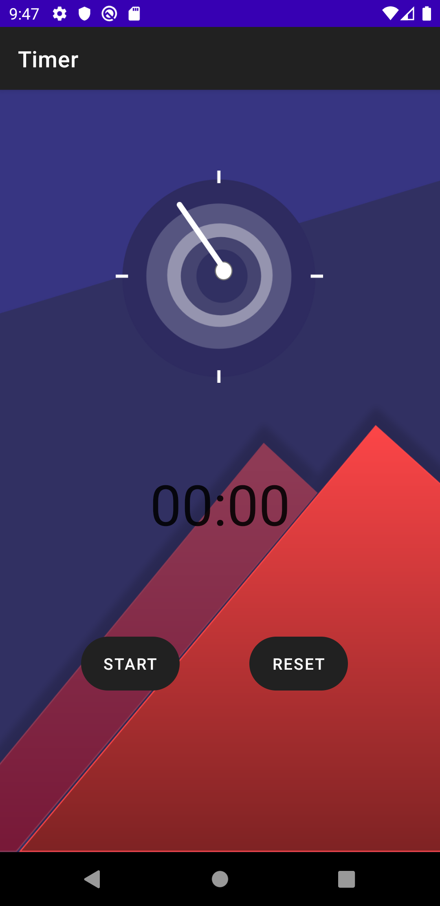

# Stopwatch UI

     
    

# Technology Used
Kotlin
Android

# About The App
This app is simply made using Chronometer. While using the app, one can do some tasks like running, exercising, etc. We have also used MVVC to handle configuration changes (like rotation) and Livedata to observe the data.
